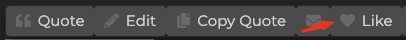

# Discourse Theme Component: Inline Hearting

This theme component allows you to "like" text sections inside a post (not just the post itself) by appending a little at the of the text section (selection).

## Features

- Support for liking images
- Simple validation checks and tooltips to inform

## Installation

1. Navigate to your Discourse admin panel.
2. Go to the "Customize" section and select "Components".
3. Choose "Import" and then "From a git repository".
4. Enter the Github URL of this theme component and click "Install".
5. Once imported, add the theme component to your active theme.

## Configuration Firebase

My current setup is with Firebase to store all the info. If you want to host your own db I suggest checking out https://pocketbase.io/.

Use the "Spark" plan with Firebase as its free and seems totally sufficient for starters.

- Add a project (if you don't yet have an existing DB)
- Add an app (Web) to your project, as this will provide you all the configuration details that we need later.
- Under "Project Shortcuts" go to "Firestore Database" and create a new "Collection" in the first panel e.g. "forum-likes".
- Create a first entry with the following data structure, all with dummy data:

*Explanation*

- count = how many likes on a text
- id = internal id
- mediaUrl = this is an image url that is used to find the image that you have liked
- text = the text you have liked
- timestamp
- topicId = id of the topic where you liked the text
- topicPostId = id of the post in the topic
- userId = id of the user who liked something
- users = array of all the users who like that text

Once thats done, you need to put in your configuration details into the component config inside your admin panel. You find those in the "App" area that you created earlier.

## How it works

- User sees some text that he liked
- He selects the text and a new button appears in the inline menu

- User pressed the Like button and the selected text is marked with a little icon

The selected text was saved in the Firestore DB alongside some meta info such as postId, topicId, and user id of the user who has clicked.
Now on page load, I query all Likes from the Firebase DB that are in the current topic.
I apply some checks to find the texts that were saved in the DB in all the posts. If I find a matching text I re-apply the heart by decorating the text with additional HTML elements.

## Todo

- Externalize tooltip strings
- Improve text detection logic
- Security check if Firebase config is save
- Code clean up - hopefully with community help :)

## Contributing

We welcome contributions to this theme component! If you have ideas for improvements or have found a bug, please open an issue or submit a pull request on our GitHub repository.

## License

This Discourse Theme Component is released under the MIT License. Everybody can use it.

Thank you for using our Discourse Theme Component. We hope it helps you create a more engaging and beautiful community!
